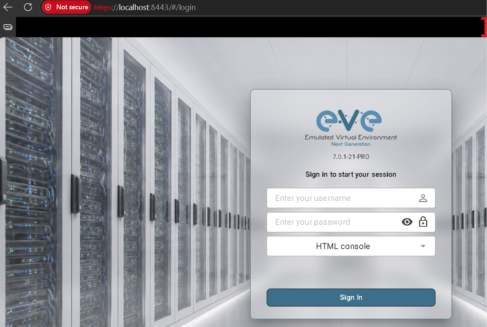
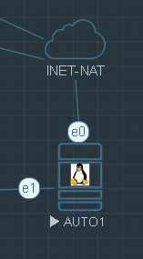
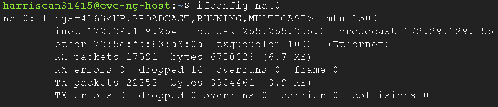
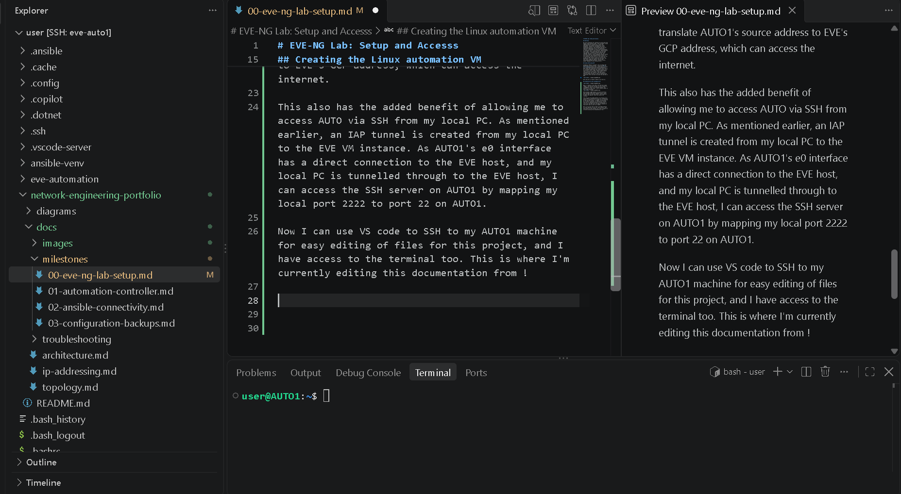

# EVE-NG Lab: Setup and Accesss

## Overview

My first milestone was creating an eve-ng VM using Google Cloud Platform (GCP). This provided a solid labbing platform allowing me to learn and experiment with network configuration using automation. Despite not providing any direct networking practise, this milestone did give me experience deploying a VM in the cloud,and I learned a technology to access the VM alternative to exposing a port to the internet: Identity-Aware Proxy (IAP). After accessing the eve lab using this method, I created my network devices and topology that will be used for the lab. This involved created a linux automation machine inside the eve-ng VM, and allowing external access to this machine from my local PC. This allows for me to use VS code locally on my PC to access the automation VM via ssh, which lets me access and edit files using the feature-rich VS code (providing markdown previews, terminal access, easier reading of file structure etc.).

## Access EVE using IAP

Instead of adding a firewall rule to expose the EVE VM GUI to the internet, I used the [IAP for TCP forwarding](https://docs.cloud.google.com/iap/docs/using-tcp-forwarding) feature provided by GCP. Using the gcloud CLI for windows,this creates an encrpyted tunnel where the proxy listens on a local port on my pc. When I make a HTTPS request from a browser on this port, the traffic is forwarded over this tunnel to the VM instance, where my google account is used to authorise the connection, and I am able to access the web GUI of EVE:

Here the port is bound to 8443 on my local pc.

## Creating the Linux automation VM

Next, I created a linux VM on the EVE host named "AUTO1". This VM has two NICs: e1 will connect to a management VLAN in my simulated network, e0 connects to a 'NAT cloud', which connects AUTO1 to eve's nat0 interface:

EVE provides a DHCP address to the e0 interface. This provides AUTO1 with internet access, since EVE uses NAT to translate AUTO1's source address to EVE's GCP address, which can access the internet.

This also has the added benefit of allowing me to access AUTO via SSH from my local PC. As mentioned earlier, an IAP tunnel is created from my local PC to the EVE VM instance. As AUTO1's e0 interface has a direct connection to the EVE host, and my local PC is tunnelled through to the EVE host, I can access the SSH server on AUTO1 by mapping my local port 2222 to port 22 on AUTO1.

Now I can use VS code to SSH to my AUTO1 machine for easy editing of files for this project, and I have access to the terminal too, as well as other extensions. This is where I'm currently editing this documentation from!

## Initial Lab Topology

See [Topology](../topology.md)